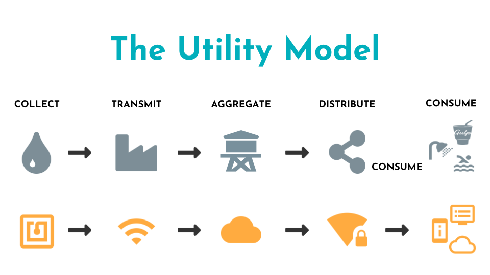
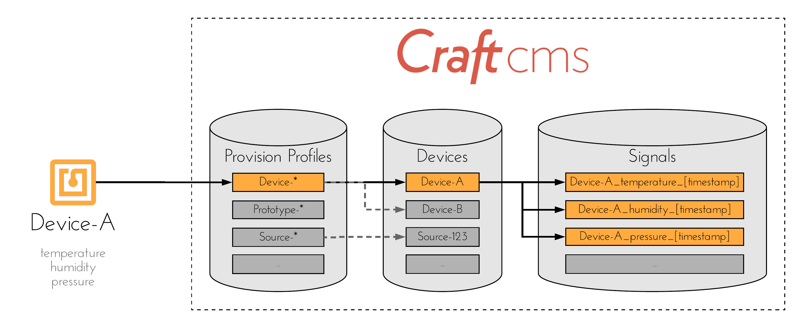

# Using Craft IoT PoC

* [Understanding The Utility Model for IoT Solutions](#understanding-the-utility-model-for-iot-solutions)
* [Craft as a Data Aggregator](#craft-as-a-data-aggregator)
* [Configuring the IoT PoC Plugin](#configuring-the-iot-poc-plugin)

## Understanding The Utility Model for IoT Solutions

Before diving too deep in to how to use this plugin, it's important to first understand how Craft fits into an IoT solution.

When describing IoT solutions in layman terms, the flow of data follows a model similar to the management of a utility, such as water or electricity. The graphic below demonstrates this relationship.

## Craft as a Data Aggregator

This plugin allows Craft to act as an aggregate point in an IoT solution. It exposes API endpoints to provision trusted data sources ("devices"), and store their transmitted data ("signals"). This is accomplished using three Entry types:

**Provision Profiles** describe which devices are allowed to transmit data to Craft, based on a user-defined serial number patterns.

**Devices** represent the data source within Craft. Configuration fields are provided to help describe the type of data being stored, such as units and precision. This allows Craft to manage data from multiple sources with varied data types - with no coding and minimal configuration - while also normalizing the data for consumption by front-end applications.

**Signals** represent the raw transmitted data, stored using a [time series](https://en.wikipedia.org/wiki/Time_series) methodology.

## Configuring the IoT PoC Plugin

-Insert text here-

### Configuring for Front-End Applications

-Insert text here-

#### Element API

-Insert text here-

#### Pusher

-Insert text here-
